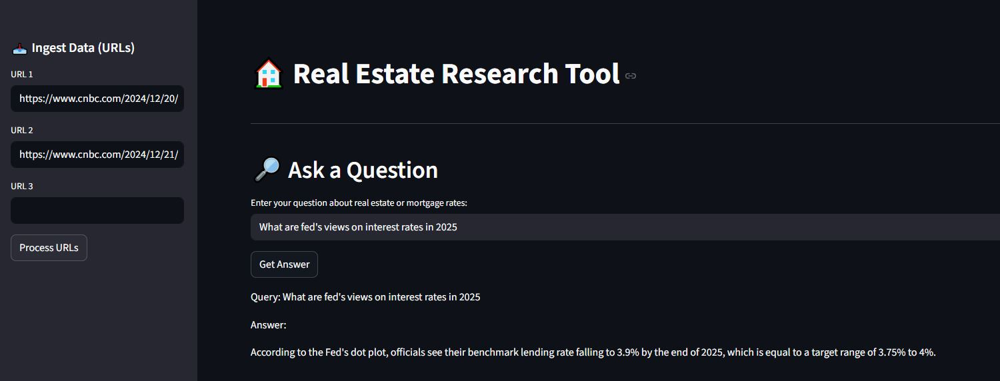

# Real Estate Research Assistant (GenAI RAG Application)

A **Retrieval-Augmented Generation (RAG)** based GenAI application that allows users to ingest real estate–related web articles and ask natural language questions to get context-aware answers using **Groq-hosted LLMs**, **Chroma vector database**, and **ONNX-based embeddings**, served through a **Streamlit UI**.

---

## Demo

### Streamlit Application Screenshot



### Live Deployed App
[Deployed URL](https://realestatetool.streamlit.app/)
[Video Link](https://youtu.be/IgtFWIy73Nk)

## Key Features

- Web-based data ingestion using Selenium (supports JavaScript-rendered pages)
- Smart text chunking with Recursive Character Text Splitter
- Vector storage & retrieval using Chroma (native client)
- ONNX-based embeddings for stability on Windows systems
- Groq Cloud LLM (LLaMA 3.1) for fast and accurate responses
- Interactive Streamlit UI
- Semantic search–powered question answering
- Clean RAG architecture (no LangChain vectorstore coupling)

## Architecture Overview

User (Streamlit UI)  
        |  
        v  
Web URLs ──> Selenium Loader  
        |  
        v  
Text Chunking (RecursiveCharacterTextSplitter)  
        |  
        v  
Chroma Vector DB (ONNXMiniLM_L6_V2 Embeddings)  
        |  
        v  
Context Retrieval  
        |  
        v  
Groq LLM (LLaMA 3.1)  
        |  
        v  
Answer Displayed to User  

## Tech Stack
| Component        | Technology                |
| ---------------- | ------------------------- |
| UI               | Streamlit                 |
| LLM              | Groq Cloud (LLaMA-3.1-8B) |
| Vector DB        | Chroma (Native Client)    |
| Embeddings       | ONNXMiniLM_L6_V2          |
| Web Scraping     | Selenium                  |
| Text Splitting   | langchain-text-splitters  |
| Environment Mgmt | python-dotenv             |
| Language         | Python 3.10+              |

## Installation & Setup
1. Clone the Repository
```
git clone https://github.com/<your-username>/realestate-assistant.git
cd realestate-assistant
```

2. Create Virtual Environment
```
python -m venv genai-env
genai-env\Scripts\activate   # Windows
```
3. Install Dependencies
```
pip install -r requirements.txt
```
4. Set Environment Variables
Create .env file:
```
GROQ_API_KEY=your_groq_api_key_here
```
5. Run the application
```
streamlit run main.py
```
## Example Use Case

1. Enter real estate or finance article URLs
2. Click “Process URLs”
3. Ask questions like:
  - How do Federal Reserve rate cuts affect mortgage rates?
  - Why did mortgage rates rise despite interest rate cuts?
4. Get context-aware answers instantly

## Design Decisions & Learnings

- ❌ Avoided HuggingFace embeddings due to repeated instability on Windows systems
- ✅ Adopted **ONNXMiniLM_L6_V2 embeddings** for reliability and performance
- ✅ Used **Chroma native client** instead of LangChain vectorstore to avoid interface mismatches
- ✅ Limited LangChain usage to **LLM orchestration only**
- ❌ Selenium not used in cloud deployment due to platform constraints
- ✅ Implemented cloud-safe ingestion using `WebBaseLoader`
- ✅ Handled Streamlit rerun behavior using `st.session_state`

This project involved resolving multiple real-world issues related to:
- environment mismatches
- dependency conflicts
- cloud deployment constraints
- UI state management

## Deployment Notes (Streamlit Cloud)

- The deployed version uses **HTTP-based web scraping (`WebBaseLoader`)** instead of Selenium.
- This is due to **Streamlit Cloud restrictions**, which do not support browser-based tools like Selenium or Playwright.
- Selenium-based ingestion is fully supported in **local environments**.

This design ensures:
- Cloud compatibility
- Stable deployments
- Clear separation between local experimentation and production demos

## Challenges Faced

- Handling JavaScript-rendered websites during ingestion
- Resolving embedding compatibility issues across environments
- Adapting Selenium-based workflows for cloud deployment
- Debugging silent failures caused by Streamlit reruns
- Ensuring stable vector storage and retrieval in production

Each challenge was addressed through architectural changes rather than hacks,
resulting in a more robust and production-aligned GenAI system.

## Acknowledgements

- Groq Cloud
- LangChain Community
- ChromaDB
- Streamlit

## Author
Shijin Ramesh  
[LinkedIn](https://www.linkedin.com/in/shijinramesh/) | [Portfolio](https://www.shijinramesh.co.in/)
